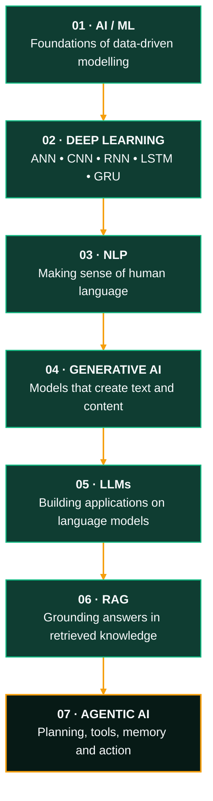
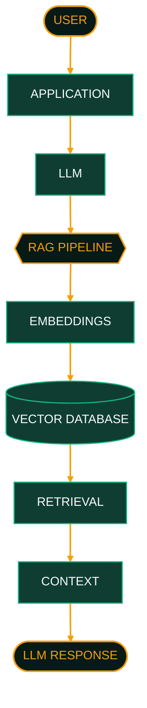
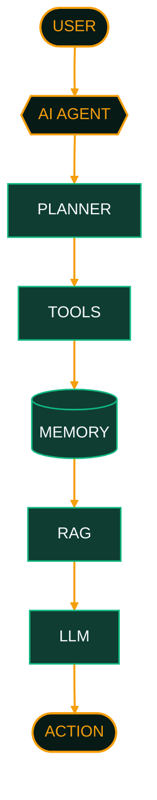
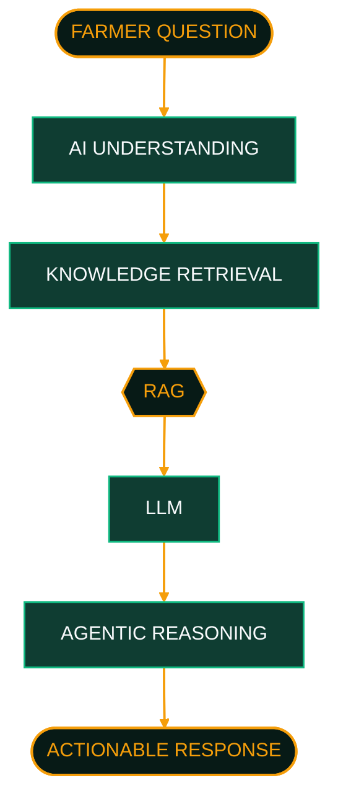

````markdown
<!-- ============================================================
     SAHIL BULBULE // AI/ML ENGINEER // PROFILE README
     Palette: #071A16  #0B1120  #0F3D32  #10B981  #F59E0B  #F8FAFC  #CBD5E1
     ============================================================ -->

<div align="center">


<br/>


<br/><br/>

<a href="https://github.com/Sahil-Bulbule"></a>
<a href="https://www.linkedin.com/in/Sahil-Bulbule"></a>
<a href="https://sahil-bulbule.vercel.app"></a>
<a href="mailto:sahilbulbule16@gmail.com"></a>

<br/><br/>

<sub><b>Python Full Stack Developer</b> &nbsp;•&nbsp; <b>Generative AI Developer</b> &nbsp;•&nbsp; <b>RAG &amp; Agentic AI Builder</b> &nbsp;•&nbsp; India</sub>

</div>

<p align="center"></p>

<h2 align="center"><code>01 // ABOUT</code></h2>

<div align="center">

</div>

```text
SAHIL@AI-LAB ~/profile

> whoami
  SAHIL BULBULE
  AI/ML Engineer • Generative AI Developer

> mission
  Building intelligent systems that solve real-world problems using
  Machine Learning, Deep Learning, LLMs, RAG and Agentic AI.

> current_stack
  Python • ML • DL • NLP • GenAI • LLMs • RAG • Agents

> backend
  Flask • Django • FastAPI • MongoDB • SQL

> frontend
  React.js • Tailwind CSS • JavaScript

> _
```

<p align="center"></p>

<h2 align="center"><code>02 // AI ENGINEERING JOURNEY</code></h2>

<p align="center"><sub>The learning path I am following, from foundations to autonomous systems.</sub></p>



<p align="center"></p>

<h2 align="center"><code>03 // CURRENT FOCUS</code></h2>

<div align="center">

</div>

<p align="center"></p>

<h2 align="center"><code>04 // TECH STACK</code></h2>

<div align="center">
<table>
  <tr>
    <td align="left"><b>LANGUAGES</b></td>
    <td align="left">
      <br/>
      <sub>Python • JavaScript • C++</sub>
    </td>
  </tr>
  <tr>
    <td align="left"><b>AI / ML</b></td>
    <td align="left">
      <code>Machine Learning</code> <code>Deep Learning</code> <code>ANN</code> <code>CNN</code> <code>RNN</code> <code>LSTM</code> <code>GRU</code> <code>NLP</code>
    </td>
  </tr>
  <tr>
    <td align="left"><b>GENERATIVE AI</b></td>
    <td align="left">
      <code>GenAI</code> <code>LLMs</code> <code>Prompt Engineering</code> <code>RAG</code> <code>Agentic AI</code>
    </td>
  </tr>
  <tr>
    <td align="left"><b>BACKEND</b></td>
    <td align="left">
      <br/>
      <sub>Flask • Django • FastAPI</sub>
    </td>
  </tr>
  <tr>
    <td align="left"><b>FRONTEND</b></td>
    <td align="left">
      <br/>
      <sub>HTML • CSS • JavaScript • React • Tailwind</sub>
    </td>
  </tr>
  <tr>
    <td align="left"><b>DATABASE</b></td>
    <td align="left">
      <br/>
      <sub>MongoDB • SQL • Firebase / Firestore</sub>
    </td>
  </tr>
  <tr>
    <td align="left"><b>TOOLS</b></td>
    <td align="left">
      <br/>
      <sub>Git • GitHub • VS Code • REST APIs</sub>
    </td>
  </tr>
</table>
</div>

<p align="center"></p>

<h2 align="center"><code>05 // AI / LLM ARCHITECTURE</code></h2>

<p align="center"><sub>Conceptual architecture of the technologies I am learning and building with. Not a deployed system.</sub></p>

<h3 align="center">RAG PIPELINE</h3>



<h3 align="center">AGENTIC AI EXTENSION</h3>



<p align="center"></p>

<h2 align="center"><code>06 // FEATURED PROJECTS</code></h2>

<div align="center">
<table>
  <tr>
    <td colspan="2" align="left">
      
      <br/>
      <b>AGRISENSE AI</b><br/>
      <sub>FARMER DECISION ASSISTANT</sub><br/><br/>
      An ongoing AI project built around FastAPI, Generative AI, RAG and Agentic AI, designed to help farmers make informed decisions.<br/><br/>
      <b>Solves:</b> aims to turn a farmer's question into grounded, actionable guidance using retrieval and LLM reasoning.<br/>
      <b>Stack:</b> FastAPI • Generative AI • RAG • Agentic AI<br/>
      <!-- Add repository link here when available -->
    </td>
  </tr>
  <tr>
    <td width="50%" align="left" valign="top">
      <b>RETAINIQ</b><br/>
      <sub>EMPLOYEE ATTRITION &amp; RETENTION ANALYTICS</sub><br/><br/>
      Streamlit application that predicts employee attrition using the IBM HR Employee Attrition dataset.<br/><br/>
      <b>Solves:</b> helps understand and anticipate attrition so retention decisions are data-informed.<br/>
      <b>Stack:</b> Python • Machine Learning • Streamlit<br/><br/>
      <a href="https://github.com/Sahil-Bulbule/RETAIN---IQ">View repository →</a>
    </td>
    <td width="50%" align="left" valign="top">
      <b>NEO INSPECT</b><br/>
      <sub>SURFACE DEFECT DETECTION</sub><br/><br/>
      Automated surface defect detection using a Convolutional Neural Network, with a Streamlit dashboard.<br/><br/>
      <b>Solves:</b> automates visual inspection by classifying surface defects from images.<br/>
      <b>Stack:</b> Python • TensorFlow • CNN • Streamlit<br/>
      <!-- Add repository link here when available -->
    </td>
  </tr>
  <tr>
    <td width="50%" align="left" valign="top">
      <b>INTRUSION X</b><br/>
      <sub>AI-BASED NETWORK INTRUSION DETECTION</sub><br/><br/>
      Deep learning system that classifies network activity as Safe or Danger using sequence models.<br/><br/>
      <b>Solves:</b> flags potentially malicious network traffic automatically.<br/>
      <b>Stack:</b> Python • RNN • LSTM • GRU • Streamlit<br/>
      <!-- Add repository link here when available -->
    </td>
    <td width="50%" align="left" valign="top">
      <b>CANCER PREDICTOR</b><br/>
      <sub>STREAMLIT ML APPLICATION</sub><br/><br/>
      Logistic Regression model served through a Streamlit interface. Accuracy: 89%. F1 Score: 97%.<br/><br/>
      <b>Solves:</b> provides a quick, model-driven cancer prediction from input features.<br/>
      <b>Stack:</b> Python • Logistic Regression • Streamlit<br/>
      <!-- Add repository link here when available -->
    </td>
  </tr>
  <tr>
    <td width="50%" align="left" valign="top">
      <b>HEART DISEASE RISK PREDICTOR</b><br/>
      <sub>STREAMLIT ML APPLICATION</sub><br/><br/>
      Machine learning application that estimates heart disease risk from patient inputs.<br/><br/>
      <b>Solves:</b> makes risk prediction accessible through a simple interactive interface.<br/>
      <b>Stack:</b> Python • Machine Learning • Streamlit<br/>
      <!-- Add repository link here when available -->
    </td>
    <td width="50%" align="left" valign="top">
      <b>EXPENSE TRACKER</b><br/>
      <sub>REACT FULL-STACK WEB APP</sub><br/><br/>
      Expense tracking application with user authentication and cloud-stored data.<br/><br/>
      <b>Solves:</b> helps users record and monitor their spending.<br/>
      <b>Stack:</b> React • Tailwind CSS • Firebase • Authentication • Firestore • Context API<br/>
      <!-- Add repository link here when available -->
    </td>
  </tr>
  <tr>
    <td colspan="2" align="left" valign="top">
      <b>STUDY PLANNER WEB</b><br/>
      <sub>FRONTEND WEB APP</sub><br/><br/>
      A study planning web application built with core web technologies.<br/><br/>
      <b>Solves:</b> helps organise study tasks and time.<br/>
      <b>Stack:</b> HTML • CSS • JavaScript<br/>
      <!-- Add repository link here when available -->
    </td>
  </tr>
</table>
</div>

<p align="center"></p>

<h2 align="center"><code>07 // AGRISENSE AI</code></h2>

<p align="center">
  <b>Farmer Decision Assistant</b><br/>
  <br/>
  <sub>FastAPI • Generative AI • RAG • Agentic AI</sub>
</p>



<p align="center"><sub>Pipeline shows the intended design of an ongoing project. It is under active development.</sub></p>

<p align="center"></p>

<h2 align="center"><code>08 // DEVELOPMENT WORKFLOW</code></h2>

```text
  IDEA ─▶ RESEARCH ─▶ DATA ─▶ MODEL ─▶ API
                                        │
                                        ▼
  ITERATE ◀─ DEPLOY ◀─ TEST ◀─ INTEGRATION
     │
     └────────────▶ IDEA  (next iteration)
```

<p align="center"><b>Learn → Build → Debug → Improve</b></p>

<p align="center"></p>

<h2 align="center"><code>09 // EDUCATION</code></h2>

<div align="center">
<table>
  <tr>
    <td align="left"><b>2024 – Present</b><br/><sub>Expected 2027</sub></td>
    <td align="left">
      <b>YCCE Nagpur</b><br/>
      B.Tech CSE / Computer Technology
    </td>
  </tr>
  <tr>
    <td align="left"><b>Diploma</b></td>
    <td align="left">
      <b>Priyadarshini Polytechnic, Nagpur</b><br/>
      Diploma in Computer Engineering • <b>86.23%</b><br/>
      <sub>Institutional 2nd Rank • Final Year Project Competition: 2nd Rank</sub>
    </td>
  </tr>
  <tr>
    <td align="left"><b>10th</b></td>
    <td align="left">
      <b>CSI, Wardha</b><br/>
      <b>79.80%</b>
    </td>
  </tr>
</table>
</div>

<p align="center"></p>

<h2 align="center"><code>10 // INTERNSHIP</code></h2>

<div align="center">
<table>
  <tr>
    <td align="left">
      <b>Frontend Developer Intern</b><br/>
      Advanced Infotech, Nagpur • 2 Months<br/><br/>
      <b>Project:</b> Study Planner &amp; Expense Tracker — Focus Flow<br/>
      <b>Tech:</b> HTML • CSS • JavaScript • LocalStorage • Pomodoro • Kanban
    </td>
  </tr>
</table>
</div>

<!-- Certificate image: uncomment once /images/internship-cert.png exists in this repository
<p align="center">
  
</p>
-->

<p align="center"></p>

<h2 align="center"><code>11 // CERTIFICATIONS &amp; LEARNING</code></h2>

<div align="center">
<table>
  <tr>
    <td align="center"><b>Machine Learning</b></td>
    <td align="center"><b>Deep Learning</b></td>
    <td align="center"><b>NLP</b></td>
  </tr>
  <tr>
    <td align="center"><b>Generative AI</b></td>
    <td align="center"><b>Python</b></td>
    <td align="center"><b>C++</b></td>
  </tr>
</table>

<sub>Learning platforms: <b>Udemy</b> • <b>Forage</b></sub>
</div>

<p align="center"></p>

<h2 align="center"><code>12 // GITHUB ANALYTICS</code></h2>

<!-- Live stats from public services. If a card is rate-limited, self-host github-readme-stats or remove it. -->
<div align="center">


<br/>

</div>

<p align="center"></p>

<h2 align="center"><code>13 // CONTRIBUTION ACTIVITY</code></h2>

<div align="center">

</div>

<!-- ============================================================
     CONTRIBUTION SNAKE (disabled until generated)
     1. Create a public repo named exactly: Sahil-Bulbule (your profile repo)
     2. Add .github/workflows/snake.yml with:

        name: Generate Snake
        on:
          schedule:
            - cron: "0 0 * * *"
          workflow_dispatch:
          push:
            branches: [main]
        permissions:
          contents: write
        jobs:
          generate:
            runs-on: ubuntu-latest
            steps:
              - uses: Platane/snk/svg-only@v3
                with:
                  github_user_name: ${{ github.repository_owner }}
                  outputs: |
                    dist/github-contribution-grid-snake.svg
                    dist/github-contribution-grid-snake-dark.svg?palette=github-dark
              - uses: crazy-max/ghaction-github-pages@v3.1.0
                with:
                  target_branch: output
                  build_dir: dist
                env:
                  GITHUB_TOKEN: ${{ secrets.GITHUB_TOKEN }}

     3. Run the workflow once, then delete this comment wrapper to enable the block below.
     To change the SVG later, only edit the two URLs inside srcset and src.

<p align="center">
  <picture>
    <source media="(prefers-color-scheme: dark)" srcset="https://raw.githubusercontent.com/Sahil-Bulbule/Sahil-Bulbule/output/github-contribution-grid-snake-dark.svg" />
    
  </picture>
</p>
     ============================================================ -->

<p align="center"></p>

<h2 align="center"><code>14 // DEVELOPER TOOLKIT</code></h2>

<div align="center">
<br/>
<sub>Python • VS Code • Git • GitHub • FastAPI • Flask • Django • React • MongoDB • Firebase • Postman</sub>
</div>

<p align="center"></p>

<h2 align="center"><code>15 // CURRENTLY LEARNING</code></h2>

<div align="center">

</div>

<p align="center"></p>

<h2 align="center"><code>16 // ENGINEERING PHILOSOPHY</code></h2>

<div align="center">
<table>
  <tr>
    <td align="center">
      <br/>
      <i>"Don't just learn the technology.<br/>Build something that makes the technology useful."</i>
      <br/><br/>
      <b>Learn. Build. Break. Debug. Improve. Repeat.</b>
      <br/><br/>
    </td>
  </tr>
</table>
</div>

<p align="center"></p>

<h2 align="center"><code>17 // CONNECT</code></h2>

<div align="center">

<h1>BUILD SOMETHING INTELLIGENT.</h1>

If you're interested in AI, ML, Generative AI, RAG,<br/>
Agentic AI, or full-stack development,<br/>
let's connect.

<br/><br/>

<a href="https://github.com/Sahil-Bulbule"></a>
<a href="https://www.linkedin.com/in/Sahil-Bulbule"></a>
<a href="https://sahil-bulbule.vercel.app"></a>
<a href="mailto:sahilbulbule16@gmail.com"></a>

<br/><br/>

<sub>Also on <a href="https://instagram.com/_sah_._eel_">Instagram</a></sub>

</div>

<br/>


````
