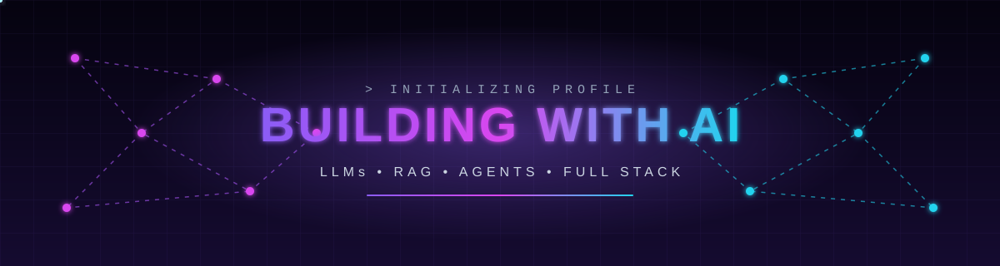

# 👋 Hey, I'm Sahil Bulbule

<!-- ───────────── WHO AM I ───────────── -->

## 🧠 Who Am I?

I'm a **Computer Science student** passionate about building intelligent systems and modern applications.

I explore the journey from **Machine Learning → Deep Learning → NLP → Generative AI → LLMs → RAG → Agentic AI**, while also building applications with **Python** and modern web technologies.

Currently sharpening my problem-solving skills through **DSA with Python**.

<!-- ───────────── AI JOURNEY ───────────── -->

## ⚡ My AI Journey

<!-- ───────────── TECH ARSENAL ───────────── -->

## 🛠️ Tech Arsenal

<table>
<tr>
<td align="center" width="200"><b>🤖 AI / Intelligence</b></td>
<td>

</td>
</tr>
<tr>
<td align="center"><b>💻 Development</b></td>
<td>

</td>
</tr>
<tr>
<td align="center"><b>🗄️ Data &amp; Backend</b></td>
<td>

</td>
</tr>
<tr>
<td align="center"><b>🧠 Problem Solving</b></td>
<td>

</td>
</tr>
</table>

<!-- ───────────── FEATURED BUILDS ───────────── -->

## 🚀 Featured Builds

<table>
<tr>
<td width="50%" valign="top">

<b>PROJECT 01</b>

### RetainIQ
**Employee Attrition & Retention Analytics**

An AI/ML-driven analytics project focused on understanding employee attrition patterns and retention insights.

**Key capabilities**
- Random Forest–based attrition prediction
- Animated gauge charts for risk visualisation
- Multi-section interactive Streamlit interface

**[Repository →](https://github.com/Sahil-Bulbule/RETAIN---IQ)**

</td>
<td width="50%" valign="top">

<b>PROJECT 02</b>

### NEO Inspect
**AI Surface Defect Detection**

A computer vision system designed to detect surface defects using CNN-based deep learning techniques.

**Key capabilities**
- Six-class CNN defect classifier
- Plotly-powered visual analysis
- AI recommendation engine for detected defects

**[Repository →](YOUR_REPOSITORY_LINK)**

</td>
</tr>
</table>

<!-- ───────────── GITHUB INTELLIGENCE ───────────── -->

## 📊 GitHub Intelligence

<!-- Snake: needs .github/workflows/snake.yml in this repo, run once from the Actions tab -->
<picture>
  <source media="(prefers-color-scheme: dark)" srcset="https://raw.githubusercontent.com/Sahil-Bulbule/Sahil-Bulbule/output/github-snake-dark.svg" />
  <source media="(prefers-color-scheme: light)" srcset="https://raw.githubusercontent.com/Sahil-Bulbule/Sahil-Bulbule/output/github-snake.svg" />
  
</picture>

<!-- ───────────── CURRENTLY EXPLORING ───────────── -->

## 🌐 Currently Exploring

<!-- ───────────── BUILDING MINDSET ───────────── -->

## 💻 Building Mindset

> **Prompt → Prototype → Break → Debug → Refine → Ship → Repeat.**
>
> *Models learn from data. I learn from bugs.*

<!-- ───────────── CONNECT ───────────── -->

## 🌐 Let's Connect

<!-- ───────────── FOOTER ───────────── -->

